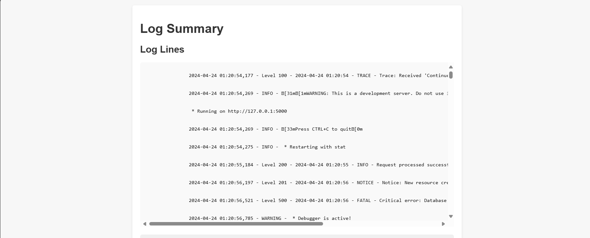
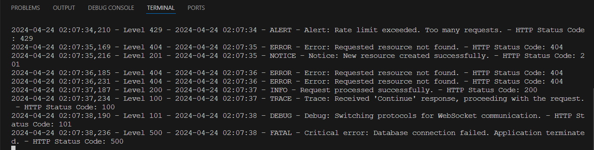

# Log Analysis and Monitoring Script


Objective: Create a script that automates the analysis and monitoring of log files

## Installation

1. Clone this repository:

    ```
    git clone https://github.com/mohanavamsi20/DevOps-Internship-Assignment.git
    ```

2. Navigate to the project directory:

    ```
    cd DevOps-Internship-Assignment
    ```

## Usage

### Running with Docker

1. Build the Docker image:

    ```
    docker build -t flask-app .
    ```

2. Run the Docker container:

    ```
    docker run -p 5000:5000 flask-app
    ```

The application will be accessible at `http://localhost:5000/`.

### Running without Docker

1. Ensure you have Python 3.x installed on your system.

2. Set up a virtual environment:

    ```
    python -m venv venv
    ```

3. Activate the virtual environment:

    - On Windows:

        ```
        venv\Scripts\activate
        ```

    - On macOS and Linux:

        ```
        source venv/bin/activate
        ```

4. Install dependencies:

    ```
    pip install -r requirements.txt
    ```

5. Run the Flask application:

    ```
    python app.py
    ```

The application will start running on `http://127.0.0.1:5000/`.


## Navigation

1. **Home**: Landing page of the application displaying log summary and options for log analysis.
   
   
   
2. **Log Analysis**: Page to view logs filtered by log level.

   

3. **Detailed Log Analysis**: Page to view detailed logs for a specific log level.

   


## Log Monitor Using CMD

You can view the Logs running random using tail command

```
tail -f app.log
```



## File Structure

- `app.py`: Flask application setup and routes.
- `logging_generation.py`: Script to generate random log messages.
- `log_monitor.py`: Blueprint for monitoring routes.
- `templates/`: HTML templates for rendering log and summary views.

## Customization

You can customize the logging behavior, log file path, and log message templates according to your requirements by modifying the `logging_generation.py` script.

## Dependencies

- Flask: Web framework for Python.
- Python 3.x: Programming language.
- Docker (if available)
## License

This project is licensed under the MIT License - see the [LICENSE](LICENSE) file for details.
